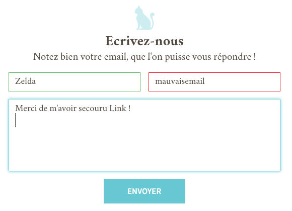

# Challenge S4-J3
Intitulé : **Validation de formulaire**  
https://github.com/O-clock-Explorer/challenge-s3-j8-form-contact-GuillaumeD84

Guillaume DURAND  
Promo : Explorer  
S4-J3 | 25/10/2017

Formateur : Julien  
Type : JavaScript | jQuery

## Objectif
Créer un formulaire de contact d'après l'image ci-dessous et qui test que tous les champs sont remplis.

## Amélioration
Modifier l'apparence des champs en fonction du résultat des test comme ci-dessous.

